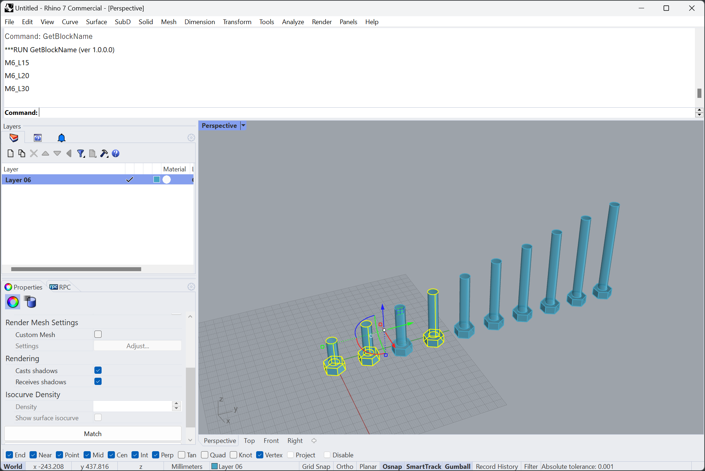

# 20240717_GET_BLOCK_NAME_COMMAND  


これの派生形です↓  
[https://github.com/viccBlog/20240131_GET_LAYER_COMMAND](https://github.com/viccBlog/20240131_GET_LAYER_COMMAND)  


指定したブロックのブロック名称をクリップボードに貼るコマンド。

オブジェクトを選んだ状態（複数可）で `GetBlockName` を実行 >> クリップボードにテキストとしてブロック名称が入ります。  
オブジェクトが選ばれていない状態で `GetBlockName` を実行 >> オブジェクトを選ぶように促されるのでオブジェクトを選ぶと（複数可）、クリップボードにテキストとしてブロック名称が入ります。  

  


## インストール  

下の URL から rhi をダウンロードして、ダブルクリック。その後、ライノの再起動で反映されるはずです。  
エラーが出たら教えてください。。。  
[https://github.com/viccBlog/20240717_GET_BLOCK_NAME_COMMAND/releases](https://github.com/viccBlog/20240717_GET_BLOCK_NAME_COMMAND/releases)  


※うまく動かなければ、それぞれもマシン上で RhinoPython エディタからコンパイルも可能です。  
プログラムはこんな感じ。  
[https://github.com/viccBlog/20240717_GET_BLOCK_NAME_COMMAND/blob/main/GetBlockName_cmd.py](https://github.com/viccBlog/20240717_GET_BLOCK_NAME_COMMAND/blob/main/GetBlockName_cmd.py)  

インストール先はここ。何かあればここを確認する。  
```
C:\Users\USER_NAME\AppData\Roaming\McNeel\Rhinoceros\7.0\Plug-ins\PythonPlugins
```


## 動作環境  

下記の環境で動作確認しています。  
- Windows11 + Rhino7 SR36  


## モチベーション

これとほぼ同様です  
[https://github.com/viccBlog/20240131_GET_LAYER_COMMAND?tab=readme-ov-file#%E3%83%A2%E3%83%81%E3%83%99%E3%83%BC%E3%82%B7%E3%83%A7%E3%83%B3](https://github.com/viccBlog/20240131_GET_LAYER_COMMAND?tab=readme-ov-file#%E3%83%A2%E3%83%81%E3%83%99%E3%83%BC%E3%82%B7%E3%83%A7%E3%83%B3)  

このコマンドを作ったのち気が付いたことですが、 `_-SelBlockInstanceNamed` とコマンドを実行し、このコマンドでブロック名称を貼り付けるとブロックマネージャでやるような作業が簡単にできるので地味に便利でした（複数のブロックを選んだ時には使えません）。  


## アルゴリズム  

```mermaid
graph TD
  Start((Run: GetBlockName))-->B{選択状態のオブジェクトを取得}
  B--オブジェクト有り--> C[オブジェクトがブロックであればブロック名称を取得]
  C-->D[ブロック名称の文字列から重複テキストを削除]
  D-->E[ブロック名称の文字列をクリップボードに貼り付け]
  E--> Z((END))
  B--オブジェクト無し--> F((オブジェクトの選択を待つ))
  F-->G{選択状態のオブジェクトを取得}
  G--オブジェクト有り--> CC(オブジェクトがブロックであればブロック名称を取得)
  CC-->DD(ブロック名称の文字列から重複テキストを削除)
  DD-->EE(ブロック名称の文字列をクリップボードに貼り付け)
  EE--> Z
  G--オブジェクト無し--> Z
  F--コマンドをキャンセル--> Z
```


## Release Note  

- v1  
  - first release  


## ref  

- “copy text to clipboard” component?  
  - [https://discourse.mcneel.com/t/copy-text-to-clipboard-component/81366](https://discourse.mcneel.com/t/copy-text-to-clipboard-component/81366)  

- Creating Rhino Commands Using Python  
  - [https://developer.rhino3d.com/guides/rhinopython/creating-rhino-commands-using-python/#windows](https://developer.rhino3d.com/guides/rhinopython/creating-rhino-commands-using-python/#windows)  

- Create RHI File  
  - [https://developer.rhino3d.com/guides/rhinopython/creating-rhino-commands-using-python/#creating-an-rhi-installer](https://developer.rhino3d.com/guides/rhinopython/creating-rhino-commands-using-python/#creating-an-rhi-installer)  
